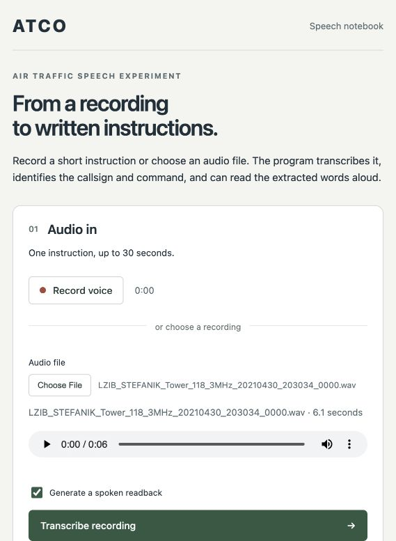
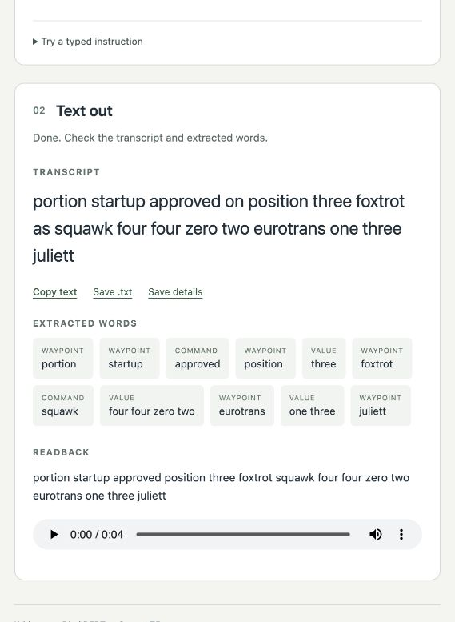

# ATCO

I wanted to know whether small, free speech and language models could turn air
traffic control radio into text that a computer can check. ATCO (Air Traffic
Control Officer) is my attempt: about thirty training and decoding experiments
on one hour of real ATC audio, and a small app that joins the pieces together.

**Audio → Whisper fine-tuned on ATC radio (Whisper-medium since the 2026 retraining) → DistilBERT word tagger → text, range checks and an optional spoken readback**

 

The screenshot is a real 6-second recording, run through my 2025 model
(Whisper-small). It also shows where the system
goes wrong: "push and start" is heard as "portion startup", and the tagger
calls words it does not know "waypoints". I left it in because those mistakes
are most of what I learned from.

The [project page](https://sineceptor.github.io/ATCO/) tells the same story in
about two minutes, with a sound demo of the simulated radio.

## Why I did this

I fly a lot. When I started reading about air traffic control I found two
things: controllers are short-staffed and work under a lot of pressure, and
pilots and controllers sometimes misunderstand each other over the radio. The
January 2024 runway collision at Haneda showed how much can hang on how one
instruction is understood. ATC speech is fast,
clipped, accented and noisy, and normal speech recognition is bad at it. In my
first tests the callsign "Eurotrans" came out as "year trans", and pure static
was transcribed as whole made-up sentences.

It started in 2025 as a team idea for an AI that could act like an air
traffic controller. That was far too big for the time I had and the tools
available then, so I narrowed it to one piece of the problem: turning the radio
speech into text a computer can check. The team did not continue, and none of
the work here is theirs.

## What I tried

The 2025 experiments all use the free one-hour subset of the
[ATCO2 corpus](docs/data.md), which I split into 699 training clips and 175
test clips.

| Stage | What I tried | What happened |
| --- | --- | --- |
| Baseline | Fine-tune all of Whisper-small | This is what I kept in 2025. In 2026 a Whisper-medium model replaced it (see Results) |
| Bigger model | Whisper-large-v3 in 4-bit with LoRA, 18 versions, plus a noise and speed stress test | 27.86% WER clean, 34.42% noisy, 28.78% fast. No better than the small model |
| More data | Noise and speed copies, then 4,808 clips of my own ATC sentences spoken by 31 TTS accents and pushed through a simulated radio | The scores I recorded moved by less than half a point, and I no longer trust how they were measured. It mostly did not work, and I think I know why |
| Decoding | Vocabulary prompts, beam search settings, silence trimming, an LLM to fix the transcript | Small gains that I later realised were tuned on the test clips |
| Understanding the text | Word lists to label callsigns, commands, values and waypoints; DistilBERT and BERT trained on those labels; Phi-3 and Qwen for comparison | The taggers copy the word lists well, but the word lists are the weak part |
| App | Browser and command-line app joining the three models, with checks on squawk codes, headings, frequencies, levels and runways | Works on my machine. You can watch an error travel from one stage to the next |

Every script, with its original messy name and what is wrong with it, is in
[experiments/](experiments/README.md).

## The main problem: one hour of data

Almost everything above was an attempt to get round having so little data. The
part I spent longest on was making my own training audio: writing a sentence
generator that follows real phraseology rules, speaking the sentences with TTS
in many accents, and then degrading the clean audio so it sounds like aircraft
radio, using band-limiting, 1/f² engine noise, static, companding, a 300 to
3400 Hz filter, clipping and a squelch click. (In 2026 I found the engine noise
had almost all disappeared inside my own filter.) That last step is signal
processing, and it is where the project meets the physics I am more used to.

It barely moved the scores I recorded at the time, and when I tested it
properly in 2026 it still did not help (see Results).
[This page](docs/limited_data_and_radio_physics.md) goes through each idea, the
physics of each stage of the radio chain, what I got wrong, and the experiment I
should have run first: word error rate against signal-to-noise ratio, which I
have now run.

## Results

When I went back over the project in 2026 I found that my test was not clean:
101 of the 175 test clips came from recordings that also gave training clips,
and I had used the test clips to tune settings. So I kept the 74 clips from
recordings no model has trained on as the test set, used the other 101 only for
choices, fixed the bugs I found and retrained.

Word error rate on the 74 unseen clips ([retraining.json](results/retraining.json)):

| Model | Word error rate | 95% range |
| --- | --- | --- |
| Whisper-small, not fine-tuned | 56.87% | 49.53 to 64.81 |
| My 2025 model | 18.64% | 14.44 to 23.19 |
| Retrained with the fixes | 19.28% | 15.37 to 23.35 |
| + my synthetic radio speech | 20.34% | 16.05 to 25.00 |
| + 10.5 hours of real ATC speech (UWB-ATCC) | 18.21% | 13.78 to 23.48 |
| Average of the fixes-only and real-speech models (model soup) | 16.72% | 13.00 to 20.68 |
| Whisper-medium with LoRA, + the same real speech | 15.23% | 11.69 to 19.13 |
| **Average of that and a Whisper-medium trained on ATCO2 only (soup)** | **14.38%** | **10.95 to 18.17** |

- Fine-tuning is by far the biggest effect. Five-fold cross-validation by
  recording over all 874 clips puts the retrained Whisper-small at 19.16%
  (95% range 17.90 to 20.45) against 53.44% unmodified
  ([cross_validation.json](results/cross_validation.json)).
- I can't detect any help the old model got from the overlap: it does slightly
  better on the unseen clips than on all 175 (20.31%).
- My synthetic speech did not help, even tested properly.
- The best model, chosen on the validation clips, averages two Whisper-medium
  models. I built that average after both models had been scored on these
  clips, so the idea was not blind to them. It is 4.26 points better than the
  2025 model, with a 95% range of 1.96 to 6.61 points. Trained on the ATCO2
  clips alone, Whisper-medium already scores 15.65%, so most of the gain comes
  from the bigger model. Restarting it with fresh adapters for more epochs did
  not help, but every run I kept was still improving at its last planned epoch. The smaller
  soup's 1.92-point gain is not certain.
- With white noise added at 0 dB (the same average power as the whole clip,
  pauses included), the best
  model's error rises from 15.44% to 40.26% and the 2025 model's from 19.81%
  to 48.03%; unmodified Whisper goes from 58.79% to 93.08% (greedy decoding
  with repetition guards).
- Spelled letters and digits are mostly right (94.41% on the unseen clips,
  [letters_digits.json](results/letters_digits.json)), but a callsign fails when
  any one of its words is wrong, so most instructions still have at least one
  field wrong: callsign, command and numbers all match in only 34 of the 74
  clips, and callsigns are the weakest of the three
  ([extraction_agreement.json](results/extraction_agreement.json)).

Every experiment, including the ones that failed, is in the
[experiment log](docs/experiment_log.md).

The word tagger scores 0.8657 weighted F1 against labels made by my word lists
([entity_extraction.json](results/rescoring_2025/entity_extraction.json)). That measures
agreement with my own rules, not accuracy against a person, and my rule for
waypoints is far too loose. [Next steps](docs/next_steps.md) lists what is
still open.

## Run it

You need Python 3.12 and the model folders described in [setup](docs/setup.md).
Model weights and audio are not in this repository.

On a Mac, once the environment is set up in `.venv`, double-clicking
`start.command` starts the browser app.

```bash
python -m pip install -r requirements.txt
python app.py                     # then open http://127.0.0.1:8765
python transcribe.py --audio /path/to/recording.wav --tts none
python transcribe.py --text "jetstar one squawk four five eight two" --tts speecht5
python -m unittest discover -s tests
```

## What is where

| Path | What it is |
| --- | --- |
| [app.py](app.py), [transcribe.py](transcribe.py), [atco/](atco/) | The app: pipeline, the three model modules, browser page |
| [training/](training/) | The training and labelling scripts behind the app's models |
| [evaluation/](evaluation/) | Re-scoring, the clean split, model comparisons with intervals, the noise sweep |
| [experiments/](experiments/README.md) | All the 2025 experiments, renamed and explained |
| [results/](results/) | Score summaries, figure data and the original 2025 result files |
| [paper/](paper/atco_paper.md) | The research paper, its figures and the scripts that build them |
| [site/](site/README.md) | The project page, and the checker that ties its numbers to results/ |
| [docs/](docs/) | [Experiment log](docs/experiment_log.md), [limited data and radio physics](docs/limited_data_and_radio_physics.md), [evaluation notes](docs/evaluation.md), [data credit](docs/data.md), [history](docs/project_history.md), [setup](docs/setup.md), [next steps](docs/next_steps.md) |
| [tests/](tests/) | Tests that run without the models |

## Credits

The models (Whisper, BERT, DistilBERT, SpeechT5, HiFi-GAN and the others) are
other people's work, and the real audio comes from the ATCO2 and UWB-ATCC
corpora ([data credit](docs/data.md)).
I used AI coding tools to help write the code and to draft and edit this
write-up. More in
[project history](docs/project_history.md).

The code is under the [MIT licence](LICENSE). The models and audio are not
included and keep their own licences.

This is a student research prototype. It must never be used for real air
traffic communication.
