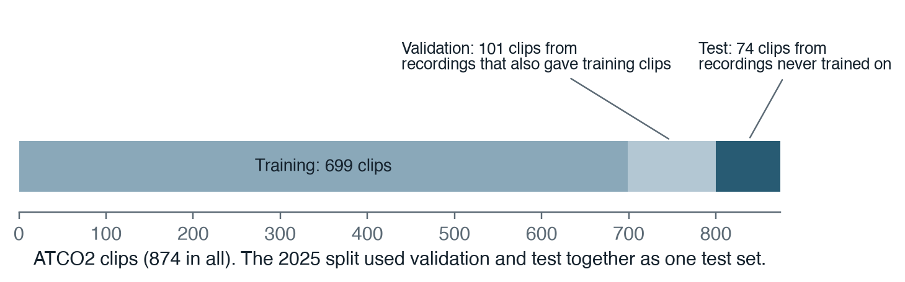
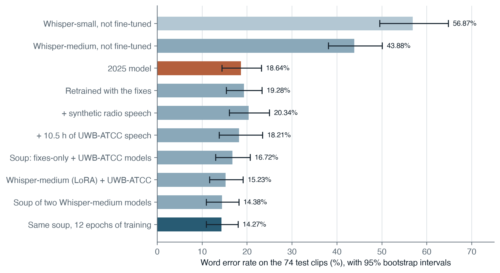
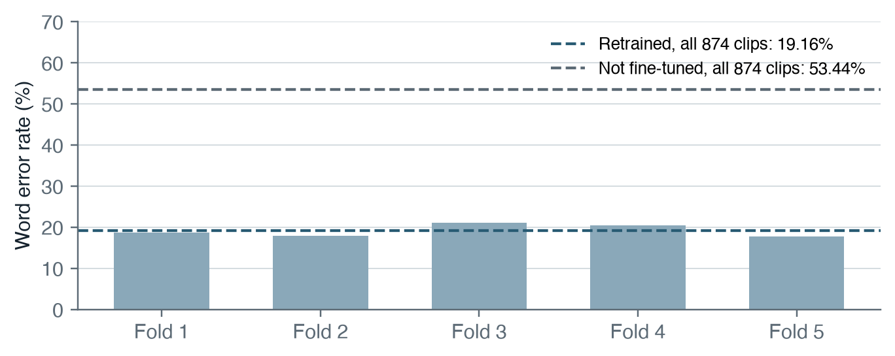
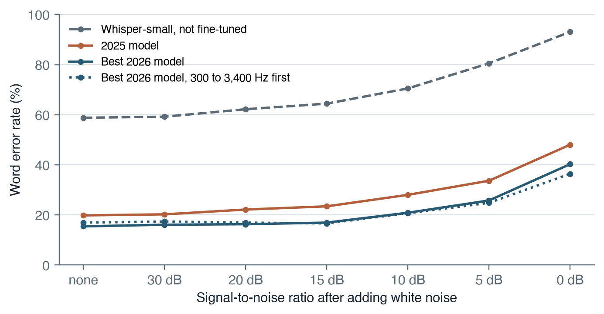
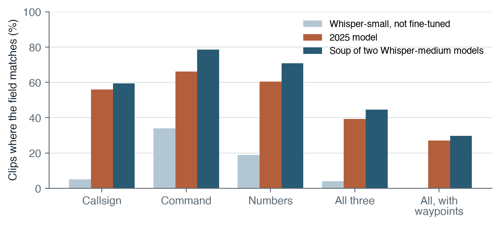
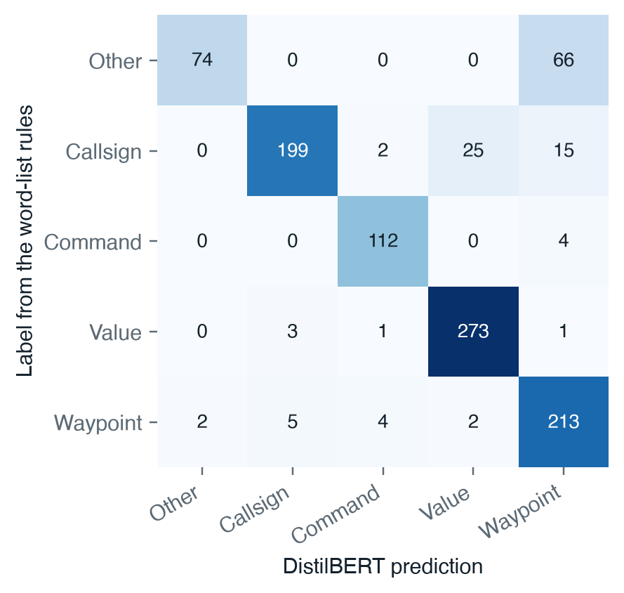

## Abstract

Air traffic control (ATC) radio is fast, accented, clipped by a narrow radio channel and full of a specialised phraseology, and general speech recognisers handle it poorly. This study asks how far a small, freely available model can be adapted to it with very little data: one hour of public ATC audio from the ATCO2 corpus (874 clips). A 2025 prototype fine-tuned Whisper-small on 699 clips and reported a word error rate (WER) of 20.31% on the remaining 175. An audit found four problems with that result: 101 of the 175 test clips came from recordings that also supplied training clips, the test clips had been used to tune the model, the training labels did not match the prompt used at inference, and one historical scorer changed its own targets. The evaluation was rebuilt so that 74 clips from recordings no model trained on form the test set, every choice is made on a separate validation set, and every comparison carries a paired bootstrap interval. On these clips unmodified Whisper-small scores 56.87% and the 2025 model 18.64%. Correcting the labels alone did not change accuracy measurably, and synthetic radio speech produced by text-to-speech and signal processing did not help. The best model, selected on validation, averages the weights of two Whisper-medium models trained with low-rank adapters, one on the ATCO2 clips alone and one with 10.5 hours of real ATC speech from the UWB-ATCC corpus added: 14.38% WER, 4.26 points better than the 2025 model (95% interval 1.96 to 6.61 points). Most of the gain comes from the larger model, and it also degrades more slowly as white noise is added. Five-fold cross-validation by recording over all 874 clips puts the Whisper-small recipe at 19.16% (95% interval 17.90 to 20.45%) against 53.44% for the unmodified model. At the level of whole instructions the picture is harsher: even the best model extracts exactly the same callsign, commands and numbers as the correct transcript in only 22 of 74 clips, and most callsign errors are misheard letters and digits rather than unfamiliar airline names.

## 1. Introduction

Controllers and pilots speak a restricted form of English. Numbers are read digit by digit, nine is said "niner", and most calls follow the same pattern: who is being addressed, what they must do and a value. The speech is fast, spoken in every accent and sent over amplitude-modulated radio whose narrow audio channel keeps roughly 300 Hz to 3.4 kHz and loses the rest. General-purpose speech recognisers, trained mostly on other kinds of speech, struggle with it; in early tests Whisper-small turned the callsign "Eurotrans" into "year trans" and wrote whole sentences from pure static.

Automatic transcription could help controllers, for example by filling in radar labels from their own speech, which has been shown to reduce wrong or missing entries in a controlled trial [8]. That requires the recogniser to be accurate on the words that matter, and it requires a trustworthy estimate of that accuracy on speech the system has never heard. This project began with the first question and ended mostly on the second.

The work has two parts. In 2025 I fine-tuned Whisper-small [1] on one hour of ATC audio, built a word tagger that labels callsigns, commands, values and waypoints, and joined them in a small application. In 2026 I audited those results, found that the evaluation did not measure what it appeared to, rebuilt it, and retrained. This paper reports the rebuilt evaluation. Its contributions are:

1. A test set of recordings unseen by every model, with all development choices made on a separate validation set, and paired bootstrap intervals for every comparison.
2. Measured answers to questions the 2025 work left open: how much fine-tuning helps, whether a label bug mattered, whether synthetic radio speech helps, and whether more real speech or a larger model helps.
3. Five-fold cross-validation by recording, so that every clip is scored by a model that never heard its recording.
4. A measurement of how quickly accuracy falls as noise is added, with and without a voice-band filter.
5. A measurement of how transcription errors propagate into the extracted instruction fields.

## 2. Data

### 2.1 ATCO2

All evaluation uses the free one-hour subset of the ATCO2 corpus (ATCO2-test-set-1h) [2], released for research: short clips of controller and pilot speech from several European airports and Sydney, with transcripts. The subset was published as a test set; this project splits it into its own training and evaluation parts, so no score here can be compared with published ATCO2 results. Transcripts are lower case with digits spelled out.

The 2025 split divided the 874 clips into 699 for training and 175 for testing, clip by clip. A recording in ATCO2 is cut into several clips, and 101 of the 175 test clips came from recordings that also supplied training clips (92 recordings in all), so the model had already heard the same voices, frequencies and background noise. The other 74 test clips come from 66 recordings with no training clips.

The 2026 evaluation keeps the 699 training clips unchanged and divides the old test clips by recording (Figure 1). The 101 clips from recordings that also supplied training clips become a validation set, used for every choice of checkpoint, decoding setting and model. The 74 clips from unseen recordings become the test set, used only to report results. Because the 2025 model was trained on exactly the same 699 clips, it can be scored on the same test set, which makes old and new models directly comparable. One caveat applies: the 2025 checkpoint itself was chosen in 2025 using the old test set, which includes these 74 clips, so its score may be slightly optimistic.

### 2.2 UWB-ATCC

The UWB-ATCC corpus [3] contains hand-transcribed controller and pilot speech from Czech airspace, released under CC BY-NC-SA 4.0. Its training split, 11,291 clips and 10.5 hours, is used only for training in this study. Its transcripts follow nearly the same conventions as ATCO2; four spellings were mapped to the ATCO2 form (decimal to point, xray to x ray, alfa to alpha, ok to okay), a mapping decided from the ATCO2 training and validation transcripts only.

### 2.3 Synthetic radio speech

In 2025 I generated 5,000 sentences from templates that follow ATC phraseology, with values drawn only from valid ranges (for example, transponder codes are octal, so no digit 8 or 9 appears). Microsoft Edge text-to-speech read them in 31 English voices at random speaking rates, and a simulated radio channel degraded the audio: band-limiting to 4 kHz, low-frequency engine noise with a 1/f² spectrum (white noise summed over time), broadband static, μ-law companding, a 300 to 3,400 Hz band-pass filter, clipping and a squelch burst. 4,808 of the clips are in the training list used here.

## 3. Auditing the 2025 work

The 2025 model was re-scored without retraining. On the 175 old test clips it scores 20.88% WER with greedy decoding (435 word edits across 2,083 reference words) and 20.31% with beam search (423 edits). Four problems emerged when the scripts and numbers were re-read.

**The test was not unseen.** As described in Section 2.1, 101 of the 175 test clips shared a recording with training clips. The test clips had also been used to pick checkpoints, tune decoding and choose the "hard words" around which extra synthetic sentences were generated.

**The labels did not match inference.** The 2025 training labels began with the start-of-transcript token followed by the no-timestamps token, and the data collator prepended a second start token. At inference, however, Whisper is prompted with start-of-transcript, English, transcribe and no-timestamps. The model was therefore trained on a slightly different task from the one it performed.

**One scorer changed its targets.** A 2025 evaluation script reached about 19% by applying phrase replacements chosen from observed errors to both predictions and references, and by deleting substrings such as NE and JA wherever they appeared, which turns ONE NINE JAPAN into O NI PAN. Reproducing it on the beam output gives 386 edits over 2,022 words, or 19.09%. That is a different scoring target, not a better transcription, and it is not used.

**The tagger was marking its own homework.** The word tagger's reference labels came from word-list rules, not from people. The rule for waypoints labels any unfamiliar word of three or more letters as a waypoint, which is far too loose.

Other historical numbers are set aside for similar reasons. A comment in a 2025 script records values of 76.18, 76.23 and 76.67 after three training rounds, labelled "acc"; the scripts computed that as 100 minus WER, but after a clean-up that altered the text, with a decoding prompt built from test-set errors, and on a test file that cannot now be confirmed. A 2025 experiment with Whisper-large-v3 in 4-bit precision with LoRA adapters scored 27.86% on the old test clips, under training and decoding settings that differ from every other model here.

## 4. Methods

### 4.1 Models

All speech models are fine-tuned from the public Whisper checkpoints [1]. Whisper-small (242 million parameters) is fine-tuned in full. Whisper-medium (764 million parameters) is too large to fine-tune in full in the memory of the laptop used here (an Apple M3 Pro with 18 GB of shared memory), so its weights were frozen and rank-32 LoRA adapters [4] were trained on every attention and feed-forward projection: 34.6 million trainable parameters, 4.3% of the model. After training the adapters are merged into the weights, so the result is an ordinary checkpoint.

A model soup [5] averages the weights of models fine-tuned from the same starting point; here it is applied to pairs of Whisper-small models and to the two Whisper-medium models. Such models often lie in the same basin of the loss surface, so their average can outperform each of them without any extra inference cost.

### 4.2 Training

All runs use the corrected labels, whose prefix matches the inference prompt, with the start token appearing once. Other settings: AdamW with weight decay 0.01, a linear learning-rate schedule with 50 warm-up steps, an effective batch of 16 clips, gradient clipping at 1.0, and SpecAugment [6] with time and frequency masking probabilities of 0.05. The learning rate is 1 × 10⁻⁵ for Whisper-small and 5 × 10⁻⁴ for the LoRA adapters. After every epoch the model transcribes the validation clips with greedy decoding and repetition guards; the checkpoint with the lowest validation WER is kept, and training stops early once validation WER has not improved for two to four epochs, fewer for the slower runs.

Training ran on the laptop's GPU. Three measures kept memory at about 6 GB for Whisper-small and 4.9 GB for Whisper-medium: gradient checkpointing, one clip per step with gradients accumulated over 16, and labels padded to a single fixed length. The last matters on Apple GPUs, where every new tensor shape compiles and caches another compute graph; with variable label lengths, memory grew until the run failed. Whisper-small trained at about 0.6 seconds per clip and Whisper-medium at about 2.9.

Where extra data was used, a fresh random sample of extra clips was drawn each epoch and mixed with all the real ATCO2 clips, so the ATCO2 speech was never outnumbered: 700 synthetic clips per epoch, 1,400 UWB-ATCC clips per epoch for Whisper-small, and 1,000 for Whisper-medium.

### 4.3 Decoding

Three decoding settings were scored for each model: greedy decoding; beam search with five beams, a repetition penalty of 1.2 and no repeated three-token sequences (the 2025 settings, called guarded beam search here); and plain beam search with five beams. For each model, the setting with the lowest validation WER is the one reported. Plain greedy decoding occasionally falls into a loop on noisy or non-English speech, repeating a phrase until the token limit; one such clip added 68 errors to a validation score during development, which is why the guards are also used whenever a model is checked during training.

### 4.4 Evaluation

WER is the number of substituted, deleted and inserted words divided by the number of reference words, pooled over all clips: WER = (S + D + I) / N. Before scoring, text is converted to upper case, punctuation is removed, and digits are spelled out, because unmodified Whisper writes "4402" where the references say "four four zero two". Other formatting differences, such as "X-ray" against "x ray", are left in place and slightly penalise the unmodified model.

Uncertainty is estimated by resampling the 74 test clips with replacement 10,000 times [7]. Differences between two models use the same resampled clips for both (a paired bootstrap), which removes much of the variation due to which clips happen to be hard.

Two further measurements address the practical question. For **noise robustness**, white Gaussian noise was added to each test clip at a signal-to-noise ratio SNR = 10 log₁₀(P_signal / P_noise) of 30, 20, 15, 10, 5 and 0 dB, with a fixed random seed per clip so that all models hear identical audio; decoding was greedy with repetition guards. For **instruction-level agreement**, the application's DistilBERT tagger was run on the correct transcript and on each model's transcript, and the extracted (field, words) pairs were compared clip by clip. This measures how much transcription error reaches the extracted fields; it does not measure the tagger's own accuracy.

## 5. Results

### 5.1 Recognition on unseen recordings

: Table 1. Word error rate on the 101 validation clips and the 74 test clips. Each model uses the decoding setting that did best on validation. Intervals are 95% bootstrap intervals over test clips.

| Model | Validation WER | Test WER | 95% interval |
| ---------------------------------------- | ------------: | ------------: | ------------ |
| Whisper-small, not fine-tuned | 63.81% | 56.87% | 49.53 to 64.81 |
| 2025 model | 21.68% | 18.64% | 14.44 to 23.19 |
| Retrained with the corrected labels | 20.02% | 19.28% | 15.37 to 23.35 |
| As above, plus synthetic radio speech | 23.08% | 20.34% | 16.05 to 25.00 |
| As above, plus UWB-ATCC | 21.68% | 18.21% | 13.78 to 23.48 |
| Soup of the corrected and UWB-ATCC models | 17.66% | 16.72% | 13.00 to 20.68 |
| Whisper-medium with LoRA, plus UWB-ATCC | 16.61% | 15.23% | 11.69 to 19.13 |
| Ablation: Whisper-medium with LoRA, ATCO2 only | 17.66% | 15.65% | 12.38 to 19.17 |
| Soup of the two Whisper-medium models | 14.86% | 14.38% | 10.95 to 18.17 |

Fine-tuning is by far the largest effect: from 56.87% for the unmodified model to 18.64% for the 2025 model on the same clips. The 2025 model does slightly better on the unseen test clips than on all 175 old test clips (20.31%), so the recording overlap had not inflated its earlier score.

: Table 2. Change in test WER relative to the 2025 model, in percentage points, with paired 95% intervals.

| Model | Change | 95% interval |
| ---------------------------------------- | ------------: | ------------ |
| Retrained with the corrected labels | +0.64 | −2.13 to +3.39 |
| Plus synthetic radio speech | +1.70 | −1.29 to +4.87 |
| Plus UWB-ATCC | −0.43 | −3.13 to +2.42 |
| Soup | −1.92 | −4.54 to +0.75 |
| Whisper-medium with LoRA, plus UWB-ATCC | −3.41 | −5.77 to −1.08 |
| Ablation: Whisper-medium with LoRA, ATCO2 only | −2.98 | −5.26 to −0.67 |
| Soup of the two Whisper-medium models | −4.26 | −6.61 to −1.96 |

The label correction did not change accuracy measurably. Synthetic speech did not help, even in a controlled comparison on unseen recordings. Adding 10.5 hours of real speech changed the test score little, but it made the model far less prone to looping: under plain greedy decoding its test WER was 19.38% against 26.52% for the model without it. Averaging the two models' weights gave the lowest validation error among the Whisper-small models, and a test score 1.92 points below the 2025 model, a gain whose interval still includes zero. Continuing to train the 2025 checkpoint with the corrected labels never improved on it on validation, so no such model was kept.

Whisper-medium with LoRA adapters had a lower validation error than any Whisper-small model. On the test clips it makes 143 word errors against 175 for the 2025 model, a reduction of 3.41 points whose 95% interval (1.08 to 5.77 points) excludes zero.

To separate model size from the extra data, an ablation declared in advance, and not eligible for selection, trained Whisper-medium in the same way on the 699 ATCO2 clips alone. It scores 17.66% on validation and 15.65% on the test clips (147 word errors), 2.98 points better than the 2025 model (95% interval 0.67 to 5.26 points). Most of the gain therefore comes from the larger model; adding UWB-ATCC improved on the ablation by a further 0.42 points on test and 1.05 on validation, differences too small to establish here. The ablation trained for five epochs of 699 clips rather than six of 1,699, so it also saw less audio.

Averaging the weights of the two Whisper-medium models, a candidate declared before any of its scores were seen, gave the lowest validation error of all, 14.86%, and is therefore the selected model. On the test clips it makes 135 word errors: 14.38%, 4.26 points better than the 2025 model (95% interval 1.96 to 6.61 points). Training the single Whisper-medium model for up to three more epochs with fresh adapters did not help: its validation error rose from 17.92% to 18.09% and 18.44% (greedy decoding with guards), so no longer-trained model was kept.

### 5.2 Every recording: cross-validation

The 74-clip test set is small, so the Whisper-small recipe was also evaluated by five-fold cross-validation over all 874 clips. The clips were grouped by recording and the recordings dealt into five folds of 174 to 177 clips; for each fold a fresh model was trained on the other four, minus a tenth of their recordings held out as validation for choosing the checkpoint, and then scored on the fold. Every clip is therefore transcribed by a model that never trained on its recording. Decoding was fixed in advance to guarded beam search.

: Table 3. Five-fold cross-validation by recording over all 874 clips (10,930 reference words).

| Model | Pooled WER | 95% interval |
| ---------------------------------------- | ------------: | ------------ |
| Whisper-small, not fine-tuned | 53.44% | 51.13 to 55.81 |
| Whisper-small retrained with the corrected labels | 19.16% | 17.90 to 20.45 |

The pooled WER of 19.16% agrees with the 74-clip estimate for the same recipe (19.28%) and has an interval about a third as wide. The folds range from 17.74% to 21.01%, a spread that shows how much a single small test set depends on which recordings it happens to contain.

### 5.3 Noise robustness

: Table 4. Word error rate as white noise is added.

| Added noise | Best model, 2026 | 2025 model | Not fine-tuned |
| ---------------------------------------- | ------------: | ------------: | ------------: |
| none | 15.44% | 19.81% | 58.79% |
| 20 dB | 16.29% | 22.15% | 62.19% |
| 10 dB | 20.87% | 28.01% | 70.50% |
| 0 dB | 40.26% | 48.03% | 93.08% |

The fine-tuned models are better than the unmodified one at every noise level, and the selected Whisper-medium soup also degrades more slowly than the 2025 model: at 10 dB it loses 5.43 points where the 2025 model loses 8.20. The Whisper-small soup, trained on the same additional speech, follows the 2025 curve closely (45.79% at 0 dB), which suggests that the larger model, rather than the extra data, accounts for most of the added robustness. Without the repetition guards the curves were not monotonic, because greedy decoding looped on a few noisy clips.

Applying a 300 to 3,400 Hz filter before adding noise barely changes the clean recordings (16.93% instead of 15.44% for the selected model), because they have already passed through a radio channel. Under heavy noise the filtered versions score better (36.42% against 40.26% at 0 dB), but this is partly an artefact of the definition: the SNR is measured on the filtered speech, while white noise spreads its power over the whole 0 to 8 kHz band, so at the same nominal SNR less of the noise falls within the band that carries the speech.

### 5.4 From words to instructions

: Table 5. Clips in which a field extracted from the model's transcript matches the field extracted from the correct transcript.

| Field | Not fine-tuned | 2025 model | Best model, 2026 |
| ---------------------------------------- | ------------: | ------------: | ------------: |
| Callsign (59 clips) | 3 | 33 | 35 |
| Command (56 clips) | 19 | 37 | 44 |
| Numbers (58 clips) | 11 | 35 | 41 |
| Every field (74 clips) | 0 | 20 | 22 |

A WER near 14% sounds like six words in seven being right, but a single wrong word can change who an instruction is for or what number it carries. Even the best model produces exactly the same extracted fields as the correct transcript in only 22 of the 74 clips (Table 5); its lower word error rate than the single Whisper-medium model (23 of 74) has not yet turned into more fully correct instructions. Callsigns are the weakest field. Of the 27 callsigns the best model misses, none begins with a word absent from the training transcripts: the errors are not unfamiliar airline names but misheard letters and digits, such as "hotel delta lima" heard as "hotel golf lima", the confusions the phonetic alphabet exists to prevent and that a noisy channel most easily causes.

### 5.5 Callsign letters and digits

Callsigns and registrations are spelled with the phonetic alphabet and digit words, so those words were scored on their own. Each reference letter or digit word is aligned with the model's transcript and counts as right if it is transcribed exactly; spelling variants of the same letter or digit (alfa and alpha, niner and nine) count as the same word, because the ATCO2 transcripts use both and UWB-ATCC always writes "nine".

: Table 6. Spelled letters and digit words transcribed exactly (479 on validation, 428 on test).

| Model | Validation | Test |
| ---------------------------------------- | ------------: | ------------: |
| Whisper-small, not fine-tuned | 60.54% | 66.36% |
| 2025 model | 91.23% | 93.22% |
| Best model, 2026 | 96.03% | 94.39% |

Individual letters and digits are therefore mostly right; the remaining errors are scattered confusions such as delta heard as golf or papa as bravo. A callsign fails as a whole when any one of its words is wrong, which is why whole callsigns match far less often than their letters. Giving Whisper the phonetic alphabet as a prompt made the best model worse on validation (16.96% WER against 14.86%, and 87.26% of letters right against 95.54%), so it was not adopted. A second attempt trained the best model for two more epochs with fresh adapters and a loss that counts letter and digit words three times as heavily as other words. The rule was fixed before the run: an epoch would be kept only if it beat the best model on validation for both letters and digits and overall WER. After one epoch it got 96.87% of letters and digits right against 96.03%, only four more of 479 words, while its WER rose from 14.86% to 15.38%; after two epochs the letters gain shrank (96.45%) and WER rose to 16.00%. Neither was adopted or scored on test.

### 5.6 The word tagger

Against its rule-generated references, the application's DistilBERT tagger [9] labels 871 of 1,001 words correctly, a weighted F1 of 0.8657. A separate BERT tagger [10] scored 0.9544, but against a version of the rules that disagrees on 25 of the words, so the two cannot be compared. The largest error group is 66 of the 140 words the rules call ordinary being tagged as waypoints (Figure 6). Because the references come from rules, these scores measure agreement with the rules, not accuracy. The rules also call "and" a waypoint, and so does the tagger (Section 6).

## 6. Discussion

The main result is that, on recordings the model has never heard, larger models with low-rank adapters reduce WER from 18.64% to 14.38% when two of them are averaged, that this gain survives a paired test on 74 clips, and that the ablation attributes most of it to the larger model rather than the extra speech. Most of the other interventions did not produce gains that a test of this size can detect, and one of them, synthetic radio speech, pointed the wrong way. The synthetic clips were designed with care, but text-to-speech voices are calm and clear where controllers are fast and clipped; a simulated channel changes the sound quality but not the way people speak. Real speech from a different airspace, by contrast, made the model much less prone to looping, while the larger model accounted for most of the gain in accuracy and in robustness to noise.

The measured improvement is modest next to the effect of fine-tuning itself, and the instruction-level results show why it matters anyway: at this level of WER most instructions still lose at least one field. For uses such as filling in radar labels, the relevant measure is whether each command, value and callsign is right [8], and on that measure callsigns, and within them spelled-out letters, are where further work should go.

The application reflects these results. It now uses the 2026 Whisper-medium soup when it is installed, runs it on an Apple or NVIDIA GPU when one is available, and decodes with guarded beam search. On the example recording used throughout the project, which says "push and start approved", the 2025 model produced "portion startup approved"; the 2026 model produces "proceed and start approved", closer but still wrong. The tagger then labels each "and" in the transcript as a waypoint, a habit it learned from the word-list rules, which do the same; the application now removes waypoint labels from English function words, but the underlying fix is better rules and human-checked labels.

**Limitations.** The test set has 74 clips from 66 recordings; it can confirm large effects but not separate models a point or two apart. Cross-validation over all 874 clips narrows the estimate for the Whisper-small recipe, but was not affordable for every configuration. Each configuration was trained once, so the effect of random initialisation and data order is not measured. The 2025 model's checkpoint was chosen with data that included the test clips. The ablation separates model size from the extra speech only roughly, because it also trained on less audio. The tagger has never been evaluated against human labels. The unmodified model is penalised slightly by formatting differences that spelling out digits does not remove. No test involved live traffic, and nothing here is fit for operational use.

## 7. Conclusion

With one hour of real audio, fine-tuning cut Whisper-small's word error rate on unseen ATC recordings by two thirds, from 56.87% to 18.64%. After an audit that separated recordings, moved every decision onto a validation set and attached intervals to every comparison, the best model, an average of two Whisper-medium models trained with LoRA adapters, reached 14.38%, a gain of 4.26 points that the test can confirm, together with better robustness to noise; most of the gain comes from the larger model. Cross-validation over every recording confirms the Whisper-small recipe at 19.16%. Synthetic speech did not help. The next steps are human labels for the tagger, more unseen test recordings, and direct work on the recognition of callsign letters and digits. A full log of every experiment, including those that failed, is in `docs/experiment_log.md`.

## References

[1] Radford, A., Kim, J. W., Xu, T., Brockman, G., McLeavey, C. and Sutskever, I. Robust Speech Recognition via Large-Scale Weak Supervision. arXiv:2212.04356, 2022.

[2] Zuluaga-Gomez, J., Veselý, K., Szöke, I., Motlicek, P. et al. ATCO2 corpus: A Large-Scale Dataset for Research on Automatic Speech Recognition and Natural Language Understanding of Air Traffic Control Communications. arXiv:2211.04054, 2022.

[3] Šmídl, L., Švec, J., Tihelka, D., Matoušek, J., Romportl, J. and Ircing, P. Air traffic control communication (ATCC) speech corpora and their use for ASR and TTS development. Language Resources and Evaluation 53, 449–464, 2019.

[4] Hu, E. J. et al. LoRA: Low-Rank Adaptation of Large Language Models. arXiv:2106.09685, 2021.

[5] Wortsman, M. et al. Model soups: averaging weights of multiple fine-tuned models improves accuracy without increasing inference time. ICML 2022. arXiv:2203.05482.

[6] Park, D. S. et al. SpecAugment: A Simple Data Augmentation Method for Automatic Speech Recognition. arXiv:1904.08779, 2019.

[7] Efron, B. and Tibshirani, R. J. An Introduction to the Bootstrap. Chapman & Hall, 1993.

[8] Helmke, H. et al. Automatic speech recognition and understanding for radar label maintenance support increases safety and reduces air traffic controllers' workload. Aerospace 10(6), 538, 2023.

[9] Sanh, V., Debut, L., Chaumond, J. and Wolf, T. DistilBERT, a distilled version of BERT: smaller, faster, cheaper and lighter. arXiv:1910.01108, 2019.

[10] Devlin, J., Chang, M. W., Lee, K. and Toutanova, K. BERT: Pre-training of Deep Bidirectional Transformers for Language Understanding. arXiv:1810.04805, 2018.

## Data and code

Code, result summaries and the scripts that produce every table and figure are at https://github.com/Sineceptor/ATCO. Results are in `results/`, and each number in this paper can be recomputed from them. Model weights and audio are not redistributed: the ATCO2 subset is available from https://www.atco2.org/data and UWB-ATCC from https://huggingface.co/datasets/Jzuluaga/uwb_atcc.
